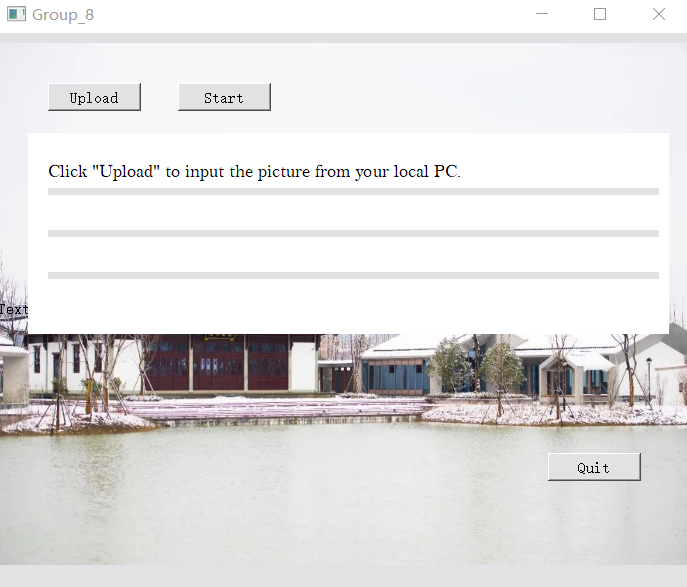
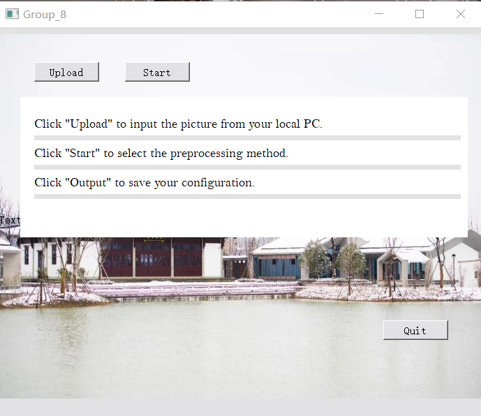
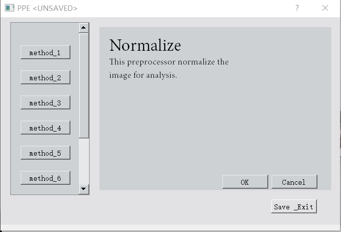
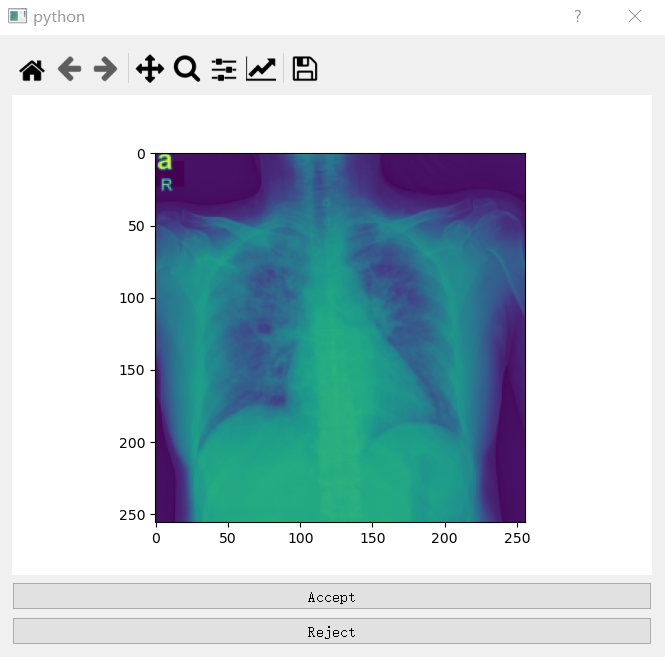
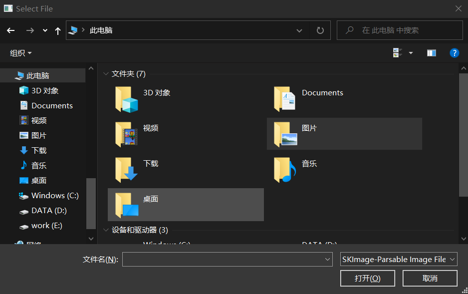
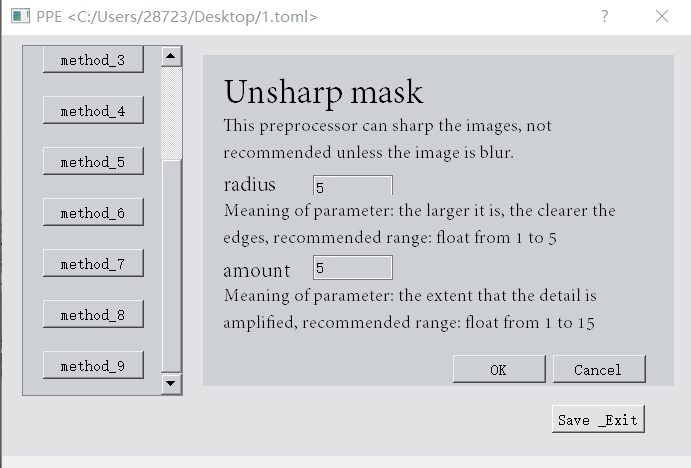
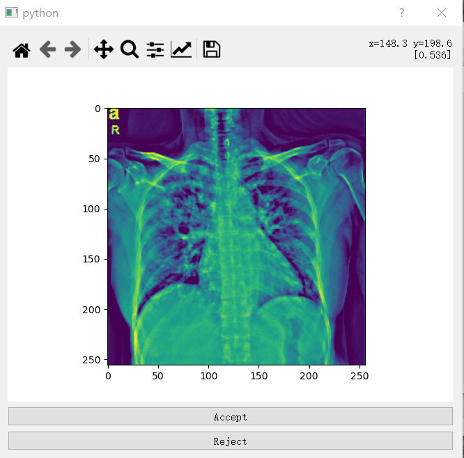
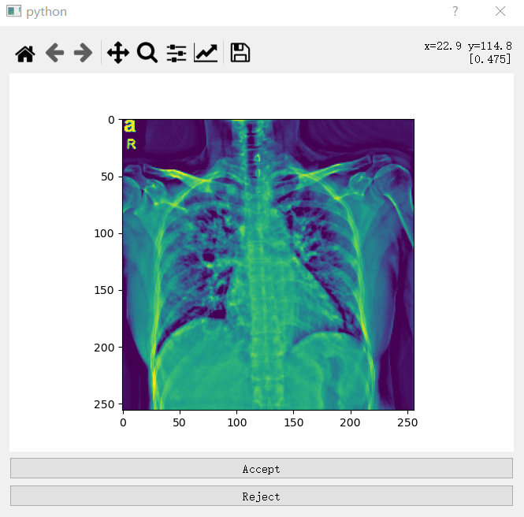

# Users' Guide for `BIA_G8`

## Concepts and Procedures


## Recommended Runtime Environment

- You are recommended to use this software on a Workstation with a recent x86\_64 (Intel/AMD) CPU and 16 GiB of memory. Using this software on domestic laptops is possible but slow.
- You are recommended to use a POSIX-compiliant operating system.  Microsoft Windows is supported but with impaired performance.
- If you wish to use pre-processors or classifiers with neuron networks (e.g., SCGAN, ToyCNN, ResNet50), you are recommended to NVidia General-Purposed Graph Processing Unit (GPGPU) with 6 GiB GDDR6 display memory (e.g., NVidia GeForce RTX 2060). Pre-trained models in CPU is not provided since training on CPU is too slow.
- Your operating system should have a Python interpreter (version at least 3.8; CPython implementation). You are recommended to manage the dependencies using [Conda](https://docs.conda.io/), which is a general-purpose user-level package management system.

## Usage with Installation

This software can be installed in the following ways:

1. Use pre-built binary wheels. Install this software using `pip install /path/to/BIA-G8-XXX.whl`.
2. Clone this repository, build the wheels using `setuptools`, and install it.
    1. Clone this repository using [Git](https://git-scm.com). We suppose you cloned it into somewhere called `{PROJECT_ROOT}`. Command: `git clone https://gitee.com/yuzjlab/2022-23-group-08`.
    2. Install `setuptool`, `build`, and `pip`.
    3. Build the wheel using `python -m build`.
    4. Install the wheel built at `{PROJECT_ROOT}/dist`.

### Using the Commandline Interface

Use a command-line version of Preprocessor Explorer using:

```shell
python -m BIA_G8._main.preprocessor_explorer --help
```

### Using the Graphical User Interface

Guidance of How to use this software 

1. Click "Upload" to input the picture from yur local PC.



2. Click "Start" to select the preprocessing method.



3. Apply your preprocessing method to your picture, and the procedures are shown as below: 
    1. Click "method_3" and click "OK", then the normalized picture will be showed up like this:

    
    

    Click "Accept" to receive the modification and you can save the new picture to your local PC. 

    
       
    2. Apply suitable preprocessing methods and parameters to your normalized picture. Here, we take the example of clicking "method_8" ('Unsharp mask'): Click "method_8" and set the radius at 5, amount at 5, then click "OK" to apply these modifications.

    

    After that, the new preprocessed picture will be showed up. Click "Accept" and the new modified picture will cover the old version. 

    

    3. Click "method_3" and "OK", then click "Accept" to to normalize the modified picture again. This modification will cover the old version as well. 

    

4. Click " Save Exit" to exit the software and complete the preprocessing steps.


````{hint}
**Always check whether you are using the correct Python Interpreter.**

Windows CMD:

```bat
where python
```

and look at the first value.

Windows Powershell:

```powershell
cmd /C where python
```

or:

```powershell
Get-Command python
```

POSIX shell with GNU CoreUtils (or similiar alternative):

```shell
which python
```

If the Python intepreter displayed is not what you want, you may retry by replacing `python` with `python3` or `py`.

Conda may not work well on Windows Powershell, so using CMD is recommended.

Conda may forget to update the `PATH` environment variable after activating the corresponding environment. If so, you may invoke Python using `${CONDA_PREFIX}/python`.
````

## Tutorials on Data Structures

The following pages contain tutorials on data structures used in this project. You may use them on your own datasets.


```{toctree}
:glob:
:maxdepth: 2

ipynb/data_structure
ipynb/ml_pp
```
